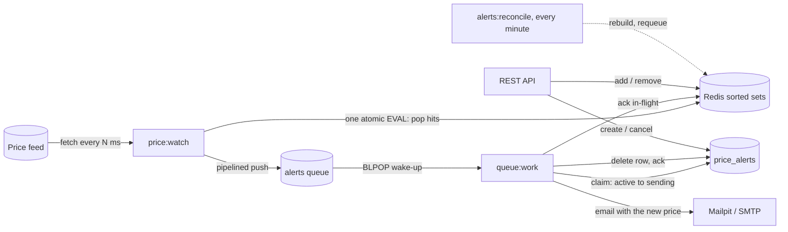

# Wallgold Price Alerts

[](https://github.com/josephyas/wallgold-price-alerts/actions/workflows/ci.yml)

A gold price alert service on Laravel 13. A user registers a target price; when the global gold price reaches or crosses it, the user is emailed the new price **once** and the alert is deleted. The design goal is the lowest possible delay between the price tick and the email, with exactly-once delivery under concurrency and at-least-once across a worker crash mid-send (the one documented duplicate path).

The service is API-only. The price feed and the mailer are behind interfaces and mocked by default: a seeded random walk stands in for the feed, and Mailpit (or the log) receives the mail.



## Quick start (Docker)

Requirements: Docker with Compose v2. Everything else runs in containers.

```bash
make up          # builds the image, writes .env with an application key, starts the stack
make watch       # follow the watcher: one line per price tick
make token       # bearer token for the seeded demo user (demo@example.com / password)
make push PRICES="2690 2701.25"   # steer the fake feed to exact prices
make test        # run the test suite inside the container
make down        # stop the stack (data volumes are kept)
```

Without `make`:

```bash
cp .env.example .env
docker compose build app
docker compose run --rm --no-deps app php artisan key:generate --show   # paste into APP_KEY in .env
docker compose up -d
```

The API listens on http://localhost:8000 (`/up` is the health check) and Mailpit's inbox is at http://localhost:8025.

The stack is seven containers: the API, one price watcher, one queue worker (`docker compose up -d --scale worker=4` for more), the scheduler, Redis, MySQL and Mailpit, plus a one-shot migrate-and-seed service the others wait for. The seed creates the demo user and two alerts far from the current price, so only the alert you create fires.

### Walkthrough

```bash
TOKEN=$(make -s token)
AUTH=(-H "Authorization: Bearer $TOKEN" -H 'Accept: application/json' -H 'Content-Type: application/json')

curl -s localhost:8000/api/price "${AUTH[@]}"                                   # current price, around 2650
ID=$(curl -s -X POST localhost:8000/api/alerts "${AUTH[@]}" -d '{"target_price":"2700"}' | sed -E 's/.*"id":([0-9]+).*/\1/')   # 201, direction "above" inferred
make push PRICES="2690 2701.25"                                                 # walk the price across the alert
make watch                                                                      # "... price=2701.2500 ... matched=1"
open http://localhost:8025                                                      # "Gold price alert: 2,700.00 USD/oz reached"
curl -s -o /dev/null -w '%{http_code}\n' localhost:8000/api/alerts/$ID "${AUTH[@]}"   # 404: delivered alerts are deleted
make push PRICES="2702"                                                         # nothing fires again
```

### Mirrors

Images and packages are pulled from ArvanCloud's mirrors by default (`docker.arvancloud.ir` for Docker Hub images, `mirror.arvancloud.ir/alpine` for Alpine packages), so the stack builds quickly from inside Iran. PHP 8.4 and every extension are installed as binary Alpine packages, so the build never compiles anything. Outside Iran, or if the mirrors are unreachable, set these in `.env` before `make up`:

```dotenv
DOCKER_REGISTRY=docker.io
APK_MIRROR=https://dl-cdn.alpinelinux.org/alpine
```

Composer has no ArvanCloud mirror; `COMPOSER_MIRROR` accepts any Packagist-compatible repository URL if you need one.

### Bare metal

PHP 8.4 with the `redis`, `pcntl`, `bcmath`, `intl` and `pdo_sqlite` extensions, Composer, and a Redis (`docker compose up -d redis mailpit` publishes both on loopback). In `.env`:

```dotenv
DB_CONNECTION=sqlite
DB_DATABASE=/absolute/path/to/database/database.sqlite
REDIS_HOST=127.0.0.1
QUEUE_CONNECTION=redis
CACHE_STORE=redis
MAIL_MAILER=log          # or smtp with MAIL_HOST=127.0.0.1 MAIL_PORT=1025 for Mailpit
```

Then, in separate terminals:

```bash
composer install && php artisan key:generate && php artisan migrate --seed
php artisan serve --no-reload
php artisan queue:work redis --queue=alerts,default --sleep=0.1 --tries=3 --timeout=60
php artisan price:watch -v
php artisan schedule:work
```

With `MAIL_MAILER=log` the email lands in `storage/logs/laravel.log`.

## How a tick becomes an email

1. **Watcher.** `price:watch` asks the `PriceProvider` for a quote every `GOLD_POLL_INTERVAL_MS` (default 1000, minimum 100). It is a long-running loop, not a scheduled task: the framework stays booted between ticks and the interval can be sub-second.
2. **Match.** Active alerts are mirrored into two Redis sorted sets, `alerts:above` and `alerts:below`, scored by target price with the alert id as member. One Lua script per tick records the current price, takes every "above" alert at or under the price and every "below" alert at or over it, removes them from their sets and parks them in `alerts:inflight`. The script is atomic, so several watchers can run at once without popping the same alert twice, and the lookup costs O(log N + hits) however many alerts exist.
3. **Dispatch.** The popped ids become `DeliverPriceAlert` jobs pushed to the `alerts` queue in one pipelined round trip per thousand. The watcher never waits on an email.
4. **Claim.** A worker blocked in `BLPOP` picks the job up within milliseconds. The job claims the row with one conditional update, `active` to `sending`, which is atomic on MySQL, Postgres and SQLite. Two jobs for the same alert cannot both win, whatever produced the second one.
5. **Send, delete, ack.** The user is emailed the new price, the row is deleted (the brief asks for deletion), and the in-flight entry is acknowledged.
6. **Reconcile.** `alerts:reconcile` runs every minute and repairs whatever drifted: an unbuilt index, active alerts missing from it, a popped alert whose job was lost, a delivery stuck in `sending`.

### Direction rules

"Reaches or crosses" is an inclusive level test on the latest tick: an `above` alert fires when `price >= target`, a `below` alert when `price <= target`. A price that gaps over several targets in one tick fires all of them.

- Without `direction`, the target is compared with the current price: above it watches for a rise, under it for a fall. A target equal to the current price is refused as ambiguous.
- With `direction`, the alert is accepted as long as the current price does not already satisfy it. This is also the only way to create an alert while no fresh price is known.
- Every tick is matched, even when the price has not moved, so an alert re-indexed at exactly the current level still fires on the next tick.

### The pop script

```lua
-- KEYS: 1 above, 2 below, 3 inflight, 4 ready, 5 current
-- ARGV: 1 price_minor, 2 now_ms, 3 limit, 4 source, 5 observed_at_ms
if redis.call('EXISTS', KEYS[4]) == 0 then return false end
redis.call('HSET', KEYS[5], 'price', ARGV[1], 'observed_at', ARGV[5], 'received_at', ARGV[2], 'source', ARGV[4])
local limit = tonumber(ARGV[3])
local above = redis.call('ZRANGE', KEYS[1], '-inf', ARGV[1], 'BYSCORE', 'LIMIT', 0, limit)
local below = {}
if #above < limit then
    below = redis.call('ZRANGE', KEYS[2], ARGV[1], '+inf', 'BYSCORE', 'LIMIT', 0, limit - #above)
end
if #above > 0 then redis.call('ZREM', KEYS[1], unpack(above)) end
if #below > 0 then redis.call('ZREM', KEYS[2], unpack(below)) end
-- ... every hit is added to the in-flight set with the tick time as score, then returned
```

`false` means the index has not been built since Redis last lost its data; the matcher rebuilds it from the database and pops again. A Redis error reply is told apart from that sentinel and raised with its message.

## Guarantees

| Situation | What happens |
|---|---|
| Two watchers tick at once | The pop script is atomic; each alert is popped by exactly one of them. |
| The same alert is dispatched twice (retry, reconcile, second watcher) | Only one job wins the `active` to `sending` claim; the other does nothing and leaves the acknowledgement to the winner. |
| Worker dies before the mail server accepted the message | The row stays `sending`; after `GOLD_DELIVERY_STALE_AFTER_SECONDS` (120) reconcile dispatches it again and the claim re-admits it. Exactly once. A send that hangs past the job's 60 s timeout is killed, retried once the claim has gone stale, and marked `failed` after the third attempt. |
| Worker dies after the mail server accepted the message but before the row was deleted | Same re-drive: the user may receive the email twice. A rare duplicate beats a silent miss for a price alert, and this is the only path to a duplicate. |
| The mail server refuses the message (or anything fails before it accepts) | The claim is released back to `active` and the job is retried after 5 s and again after 30 s; after the third failure the alert is marked `failed` for the user to see. |
| Watcher dies between popping and dispatching | The alerts sit in `alerts:inflight`; once older than `GOLD_INDEX_INFLIGHT_TTL_SECONDS` (600) and with the queue idle, reconcile dispatches them again. |
| Redis loses its data (flushed, or restarted without persistence) | The ready flag is gone; the next tick rebuilds the index from the active rows before matching. With the Compose setup Redis persists to an append-only file, so a plain restart keeps the index; writes lost in the last fsync window are found missing and added back by reconcile within a minute. |
| Redis is down when an alert is created or cancelled | The outage counts as "price unknown": creating without a direction answers 422, creating with an explicit direction commits the row and answers 201 (the index write is retried, then reported), and cancelling answers 204. Reconcile finds the row missing from the index within a minute and adds it back. `GET /api/price` answers 503 meanwhile. The API rate limiter lives in the database store (`CACHE_LIMITER_STORE`), so the API itself stays up. |
| The user cancels while the alert is being delivered | The conditional delete refuses with 409 until the delivery finishes (and deletes the row itself). |
| The price gaps over several targets in one tick | All of them fire, each once. |
| The price bounces around a target | It fires on the first crossing; the alert is gone afterwards. |
| The feed is down or returns garbage | `PriceUnavailable` makes the watcher back off exponentially (up to 10 s). Zero, negative and non-numeric values are rejected at the provider. A plausibility band (maximum move per tick) would be the next guard. |
| A stale index entry survives a rebuild race | The job checks the real row: a price that does not hit it puts it back into the index without sending. |

## Latency

Time from tick to email, after the feed has answered:

| Step | Cost |
|---|---|
| Pop (one Lua call) | sub-millisecond at any realistic index size |
| Push jobs | one pipelined round trip per 1000 alerts |
| Worker wake-up | `BLPOP`, about a millisecond |
| Claim | one indexed single-row update |
| Render and hand to SMTP | tens of milliseconds; the demo delivery takes 100 to 200 ms on a laptop, most of it in the mailer |

The poll interval dominates everything else, and it is bounded by the provider: the fake feed is happy at a few hundred milliseconds, real HTTP APIs usually allow far fewer calls (goldapi.io's free tier is a few hundred per day). A streaming provider (WebSocket) is the upgrade path to sub-second alerts; nothing after the tick would change.

Under a spike where one tick hits M alerts, the watcher finishes in M/1000 round trips and the mail backlog drains at roughly M x (time per email) / workers. Scale workers, not watchers. A million indexed alerts cost Redis roughly 100 MB.

## Data model

`price_alerts` holds only alerts that still have work to do; delivered alerts are deleted.

| Column | Type | Notes |
|---|---|---|
| `user_id` | FK, cascade | |
| `direction` | `above` / `below` | |
| `target_price` | bigint | minor units (price x 10^4), exact, doubles as the sorted-set score |
| `reference_price` | bigint, nullable | price when the alert was created |
| `status` | `active` / `sending` / `failed` | |
| `triggered_price`, `triggered_at` | nullable | set when the delivery is claimed |
| `attempts`, `last_error` | | delivery bookkeeping |

Indexes: unique `(user_id, direction, target_price)`; `(user_id, created_at)` for listing; `(status, direction, target_price)` for the rebuild; `(status, updated_at)` for the stuck-delivery sweep.

Prices are handled everywhere as the `Price` value object: four decimal places stored as an integer number of minor units, parsed with bcmath and rounded half-up. Sorted-set scores are therefore exact integers, never floats.

Redis keys (with the configured prefix):

| Key | Type | Content |
|---|---|---|
| `alerts:above`, `alerts:below` | sorted set | score = target in minor units, member = alert id |
| `alerts:inflight` | sorted set | score = popped-at ms, member = `id:price` |
| `alerts:ready` | string | exists once the index was built from the database |
| `price:current` | hash | last quote: price, observed_at, received_at, source |
| `price:fake:queue` | list | scripted prices for the fake feed |
| `alerts:above:building`, `alerts:below:building` | sorted set | temporary sets a rebuild fills before swapping them in |

The rebuild also takes a `price-alerts:index:rebuild` lock in the cache store so concurrent rebuilds wait for one another.

## Configuration

| Variable | Default | Meaning |
|---|---|---|
| `GOLD_PRICE_PROVIDER` | `fake` | `fake` (seeded random walk) or `goldapi` |
| `GOLD_PRICE_UNIT` | `USD/oz` | label shown in emails and the API |
| `GOLD_POLL_INTERVAL_MS` | `1000` | watcher interval, minimum 100 |
| `GOLD_PRICE_MAX_AGE_MS` | `10000` | a recorded price older than this counts as unknown |
| `GOLD_FAKE_START`, `GOLD_FAKE_MAX_STEP`, `GOLD_FAKE_SEED` | `2650.00`, `2.00`, empty | fake feed start, maximum move per tick, and seed (an integer makes the walk repeatable; empty means a fresh walk each start) |
| `GOLDAPI_URL`, `GOLDAPI_TOKEN`, `GOLDAPI_TIMEOUT` | goldapi.io XAU/USD, empty, `2.0` | real feed |
| `GOLD_REDIS_CONNECTION` | `default` | Redis connection (from `config/database.php`) holding the index and the fake-feed queue |
| `GOLD_INDEX_POP_BATCH` | `1000` | alerts popped per Lua call (keep at or under 1000) |
| `GOLD_INDEX_DISPATCH_BATCH` | `1000` | jobs per pipelined push |
| `GOLD_INDEX_INFLIGHT_TTL_SECONDS` | `600` | popped alerts older than this with an idle queue are dispatched again |
| `GOLD_DELIVERY_STALE_AFTER_SECONDS` | `120` | a `sending` claim older than this can be taken over |
| `GOLD_MAX_ALERTS_PER_USER` | `100` | stored alerts per user |
| `GOLD_API_RATE_PER_MINUTE` | `60` | API requests per user per minute |
| `CACHE_LIMITER_STORE` | `database` | cache store behind the API rate limiter; kept off Redis so an index outage cannot take the API down |
| `REDIS_QUEUE_BLOCK_FOR` | `5` | seconds a worker blocks on `BLPOP` |
| `REDIS_QUEUE_RETRY_AFTER` | `90` | must exceed the job timeout (60) |

`.env.example` lists the common variables; anything absent from `.env` falls back to the defaults in `config/gold.php`. The Redis index requires the phpredis client (`REDIS_CLIENT=phpredis`, the default).

## API

All endpoints live under `/api`, speak JSON, and are rate limited (`GOLD_API_RATE_PER_MINUTE` per user, 10 per minute for the authentication endpoints). Authentication uses Sanctum bearer tokens.

| Method and path | Auth | Body | Response |
|---|---|---|---|
| `POST /api/auth/register` | none | `name`, `email`, `password`, optional `device_name` | 201 `{token, token_type, user}` |
| `POST /api/auth/token` | none | `email`, `password`, optional `device_name` | 200 `{token, token_type}` |
| `GET /api/auth/me` | token | | 200 `{data: {id, name, email}}` |
| `DELETE /api/auth/logout` | token | | 204, revokes the current token |
| `GET /api/price` | token | | 200 `{data: {price, unit, source, observed_at, received_at, stale}}`, or 503 before the first tick |
| `GET /api/alerts` | token | query `status`, `per_page` | 200 paginated list of the caller's alerts, newest first |
| `POST /api/alerts` | token | `target_price` (up to 4 decimals), optional `direction` (`above`/`below`) | 201 the alert |
| `GET /api/alerts/{id}` | token, owner | | 200 the alert |
| `DELETE /api/alerts/{id}` | token, owner | | 204, or 409 while the alert is being delivered |

Validation failures and rule violations (equal to the current price, would trigger immediately, duplicate, limit) return 422 with an `errors` object; missing or revoked tokens return 401; another user's alert returns 403; exceeding a limit returns 429. A user may hold one alert per level and side; a previous alert at the same level that ended in `failed` is replaced automatically.

## Postman

`postman/` holds a collection and a local environment covering every endpoint:

```
postman/wallgold-price-alerts.postman_collection.json
postman/wallgold-price-alerts.postman_environment.json
```

Import both into Postman, run **Authentication > Request a token** (it signs in as the seeded demo user and stores the
token every other request uses), then work through the folders. Pressing **Run** executes the whole collection: it
registers a user, reads the price, creates two alerts, lists and inspects them, checks the error responses, then
cancels the alerts and logs out, so it can be run repeatedly.

Each request carries a description of the rule it demonstrates, and each has tests, so the collection doubles as an
executable specification of the API:

```bash
npx newman run postman/wallgold-price-alerts.postman_collection.json \
  -e postman/wallgold-price-alerts.postman_environment.json
```

To watch an alert fire, create one and walk the price across it with `make push PRICES="2740 2751"`.

## Operations

- **Processes.** One watcher, as many workers as the mail volume needs, one scheduler. All three are ordinary Artisan commands; the Compose file runs them as services and restarts them, and under Supervisor or systemd the same commands apply (`price:watch -v`, `queue:work redis --queue=alerts,default --sleep=0.1 --tries=3 --timeout=60 --max-time=3600`, `schedule:work` or a cron entry for `schedule:run`).
- **Redis** runs with append-only persistence in Compose. Losing it entirely is safe: the next tick rebuilds the index.
- **`php artisan alerts:reconcile [--rebuild]`** can be run by hand at any time; `--rebuild` forces a full reindex.
- **`php artisan price:fake-push 2690 2701.25`** steers the fake feed.
- **Failed deliveries** show up as `status: failed` in the API with `last_error`; `php artisan queue:failed` lists the underlying jobs.
- **Logs** carry alert ids and prices, never email addresses.
- **Production notes.** The image installs dev dependencies so the suite can run inside it; build with `composer install --no-dev` for production. `artisan serve` is a development server; put nginx and php-fpm, or Octane, in front of the API for real traffic, and configure trusted proxies in `bootstrap/app.php` so rate limits key on the client address rather than the proxy's. Nothing in the pipeline depends on the web server.

## Testing

```bash
composer install
php artisan test          # SQLite in memory, no services needed
composer check            # Pint, Larastan (level 6), tests
```

Tests marked `redis` exercise the real Lua scripts against a dedicated Redis database and are skipped when no Redis is reachable; `docker compose up -d redis` (published on `127.0.0.1:6379`) and `REDIS_HOST=127.0.0.1 REDIS_REQUIRED=1 composer check` makes them mandatory, which is what CI does.

What is covered: the value objects and direction rules; both index implementations through one shared contract (including the atomic pop, batching, in-flight tracking and rebuild); the providers with faked HTTP; the delivery job's every path (send once, missing row, failed row, stale entry, lost claim, abandoned claim, refused message, final failure); the matcher (gaps, bounces, sides, batching, rebuild); the watcher (single tick, failure, backoff); reconcile (each repair, and the idle-queue rule); the API (rules, ownership, throttling); and the end-to-end flow through the real HTTP layer and watcher command, against both indexes.

PHPUnit cannot race two workers, so concurrency is proven differently: the atomic-pop test shows a second pop returns nothing, and the delivery tests run a second job for the same alert while the first one holds the claim and is inside the mailer, showing that exactly one email goes out.

## Design decisions

**Why a Redis sorted set instead of an indexed query?** A `(status, direction, target_price)` index also finds the hits in O(log N + hits). The sorted set buys two things: an atomic pop, so concurrent tickers and retries can never double-fire without `SELECT ... FOR UPDATE SKIP LOCKED`, and no database round trip per tick, which matters when the tick is sub-second. Below roughly a hundred thousand alerts a database query per tick would be perfectly fine; the index is what keeps the tick cheap at scale.

**Why both an in-flight set and a `sending` status?** They cover different failures. The in-flight set catches alerts that were popped but never claimed (a watcher died between pop and push, a job was lost). The `sending` status catches alerts that were claimed but never finished (a worker died mid-send). Without the in-flight set, the drift check would wrongly rebuild on every tick that has jobs in flight.

**Two workers get the same alert.** Both load the row as `active`. Both run `UPDATE ... SET status='sending' WHERE id=? AND status='active'`. The database serialises the two updates; one affects a row, the other affects none. The winner sends and deletes; the loser returns without acknowledging, because the winner will.

**Per-alert jobs rather than chunks.** Each delivery retries and fails independently and spreads across workers; the cost is one job per alert, pushed a thousand at a time in one round trip. Chunked jobs would be the next knob for very large spikes.

**Send, then delete.** The brief asks for the alert to be deleted after the user is notified, and the row is the only record. A `price_alert_deliveries` history table is the obvious extension if an audit trail is needed; it was left out to keep the schema to what the brief requires.

**Why is a target equal to the current price refused?** "Reaches" is already true, and neither side can be inferred. With an explicit direction the request is still refused when the price already satisfies it, so a client cannot create an alert that fires on the next tick by accident.

**Single instrument.** The keys and the table assume one price series (XAU/USD). Multiple instruments would add an `instrument` column and a key prefix per instrument; nothing else changes.

**Polling.** The brief assumes an external API, so the watcher polls. The provider contract does not care where quotes come from; a streaming provider would call the same matcher per message.
